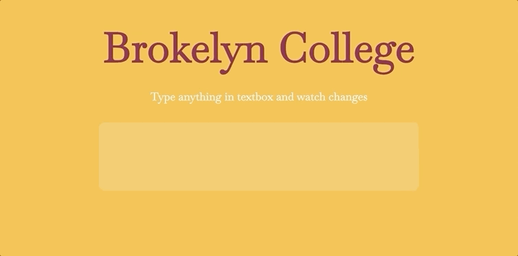

<h1>Brokelyn College, addEventListener </h1>

The program is pretty straightforward. We have variable <i>firstText</i> that accepts displayed text and basically swaps between input
states.

Written in vanilla Javascript.

<h1>Preview</h1>

